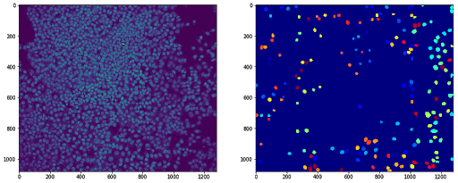
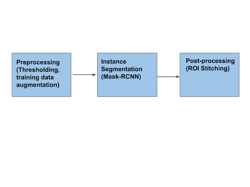
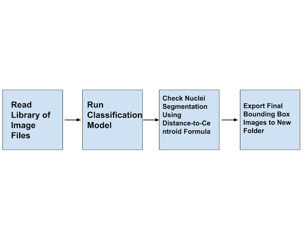

# Nuclei Microscopy Image Segmentation

## ICMJE Standard Citation:

### DOI link:



**Figure 1.** The stitching of the four regions of interest defined by the MASK-RCNN function.

### Link to Draft Manuscript:

"https://docs.google.com/document/d/16iapv26emu_iALUbv2cH5fFvNb-8KMSUNfrpsniqkJk/edit?usp=sharing">https://docs.google.com/document/d/16iapv26emu_iALUbv2cH5fFvNb-8KMSUNfrpsniqkJk/edit?usp=sharing

## Introduction

Finetuned convolutional neural networks (CNNs) have been traditionally used in the defense and security industries to classify objects of interest. However, increasingly, shallow CNNs such as AlexNet have already been used in pathology and radiology, namely to determine the malignancy of cancer tumors. Thus, biomedical scientists can readily exploit current networks designed for large-scale object recognition for microscopic biological systems.

## Current Challenges

Since the advent of image processing, a gap remains in the physical techniques used to capture cell morphology and automated segmentation techniques used to quantify the data. While electron microscopy is a commonly used technique to image cell development, often manual methods are used to count the number and positions of cell types.

However, image workflows can vary greatly between laboratories depending on the microscope model and propietary software used to capture these images. This can cause variations in the pixel density and pixel grayscale intensity. Thus, traditional thresholding methods (e.g. Otsu’s Method, Histogram Thresholding, Gaussian Filtering) can be over-deterministic and only work on a case-by-case basis. Overall, current methods are cumbersome to the end-user and require weeks of preparation before implementation.

## Why should we solve it?

This would aim to provide a more robust, novel image processing pipeline that would decrease turnaround time for analyzing biological images en masse. Researchers could import grayscale electron microscopy Z-stack images in the form of .TIFF or .PNG files and view segmented nuclei images in a separte export folder. This would save both time and provide a more scalable means of nuclei segmentation.

## What is Biological-structure-segmentation-in-microscopy-images-using-deep-learning?



**Figure 2.** Overview digram of the workflow needed for image segmentation of electron microscopy images.

## How to use Biological-structure-segmentation-in-microscopy-images-using-deep-learning

This software is based in Python 3 (Python 3.6) in Jupyter Notebook and relies on the compressed sparse graph routiness, scikit-learn and numpy packages. Ideally, a user could remote into a shared server such as BioWulf and run the script .py file after importing a folder of multiple high-resolution images.



**Figure 3.** Schematic of the steps used in the improved nuclei segmentation software.

## File structure diagram

**postprocess:** contains the post-processing stitching script to connect the regions of interest generated by the Mask-RCNN model.  This folder contains:

**train_explore.html:** the Jupyter Notebook HTML file containing both the output results and original code.

**train_explore.ipynb:** the IPython notebook file associated with the post-processing script.

**train_explore.py**: the Python script file associated with the Jupyter Notebook.

**ReadMe:** contains documentation and an overview of the nuclei segmentation pipeline.

## Installation options:

We provide two options for installing Biological-structure-segmentation-in-microscopy-images-using-deep-learning: Docker or directly from Github.

### Docker 

The Docker image contains Biological-structure-segmentation-in-microscopy-images-using-deep-learning as well as a webserver and FTP server in case you want to deploy the FTP server. It does also contain a web server for testing the Biological-structure-segmentation-in-microscopy-images-using-deep-learning main website (but should only be used for debug purposes).

1. ```docker pull ncbihackathonsBiological-structure-segmentation-in-microscopy-images-using-deep-learning```

2. ```docker run ncbihackathons/Biological-structure-segmentation-in-microscopy-images-using-deep-learning```

3. Edit the configuration files as below

### Installing Biological-structure-segmentation-in-microscopy-images-using-deep-learning from Github

1. ```git clone https://github.com/NCBI-Hackathons/Biological-structure-segmentation-in-microscopy-images-using-deep-learning.git```

2. Edit the configuration files as below

3. test with: ```sh server/Biological-structure-segmentation-in-microscopy-images-using-deep-learning.sh```

4. Add cron job as required (to execute Biological-structure-segmentation-in-microscopy-images-using-deep-learning.sh script)

## Testing

Testing was completed in Jupyter Notebook.

## Additional Functionality

### DockerFile

Biological-structure-segmentation-in-microscopy-images-using-deep-learning comes with a Dockerfile which can be used to build the Docker image.

1. ```git clone https://github.com/NCBI-Hackathons/Biological-structure-segmentation-in-microscopy-images-using-deep-learning.git```

2. ```cd server```

3. ```docker build --rm -t Biological-structure-segmentation-in-microscopy-images-using-deep-learning/Biological-structure-segmentation-in-microscopy-images-using-deep-learning . ```

4. ```docker run -t -i Biological-structure-segmentation-in-microscopy-images-using-deep-learning/Biological-structure-segmentation-in-microscopy-images-using-deep-learning```

### Website

There is also a Docker image for hosting the main website. This should only be used for debug purposes.

1. ```git clone https://github.com/NCBI-Hackathons/Biological-structure-segmentation-in-microscopy-images-using-deep-learning.git```

2. ```cd Website```

3. ```docker build --rm -t Biological-structure-segmentation-in-microscopy-images-using-deep-learning/website .```

4. ```docker run -t -i Biological-structure-segmentation-in-microscopy-images-using-deep-learning/website```